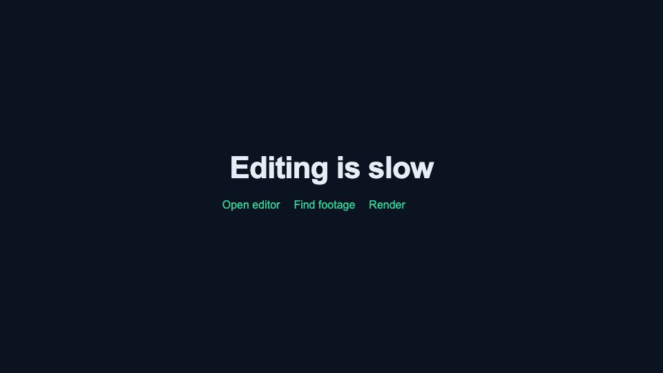

# Examples — rendered by this exact workflow

Every image/clip here was produced by the [explainer-starter template](../templates/explainer-starter/) driven by the hub's prompts — no manual editing. The frames below are actual renders (50% scale).

## Scene frames (from `data.ts`)

| Scene 1 — Intro (frame 60) | Scene 2 — Problem + bullets (frame 200) |
|---|---|
|  |  |

| Scene 3 — Solution (frame 400) | Scene 4 — CTA (frame 750) |
|---|---|
|  |  |

## Video clip

**[demo-clip.mp4](demo-clip.mp4)** — the first 8 seconds (frames 0–240), rendered at ⅓ scale (395 KB). Render the full thing yourself in ~2 minutes:

```bash
cd templates/explainer-starter && npm install && npm run render
```

## How these were made

1. [`prompts/01-scaffold.md`](../prompts/01-scaffold.md) → generated `src/data.ts` + scene skeleton
2. [`prompts/02-explainer.md`](../prompts/02-explainer.md) → filled Scene02 bullets + timing
3. Render: `npx remotion render Main out/video.mp4`
4. QA: `node tools/remotion-qa.mjs out/video.mp4` → clean pass
5. Stills: `npx remotion still Main frame.jpg --frame=<n> --scale=0.5`

Zero manual timeline editing. That's the point.
